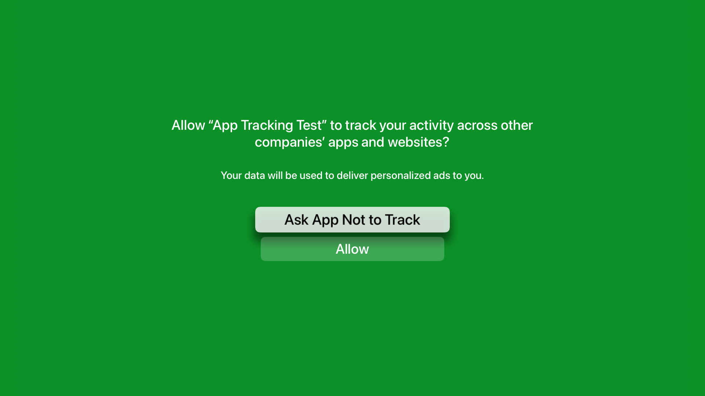

#  App Tracking Transparency Test (FB9383293)

App Tracking Transparency prompt is not displaying on tvOS 15 beta.

The "App Tracking Test" app presents a prompt to request permission to track the user. The project was created using Xcode Version 12.5 (12E262).

The project was set up using Apple's [App Tracking documentation](https://developer.apple.com/documentation/apptrackingtransparency):
- [x] Set up a NSUserTrackingUsageDescription to display a system-permission alert request for your app installed on end-user devices.
- [x] Call `requestTrackingAuthorization(completionHandler:)` to present the app-tracking authorization request to the end user.

Expected prompt:

### Steps to reproduce
1. On a tvOS 15 simulator: Simulator > Device > Erase All Content and Settings...
2. Run the sample "App Tracking Transparency" app

**_expected_**

The "App Tracking Test" app launches and present the 'Allow "App Tracking Test" to track your activities" prompt.

**_actual_**

The "App Tracking Test" app launches **but** no prompt is displayed.

### Additional Observations
The behavior is correct when running the app when built with Xcode 12.5 and running on a device with tvOS 14.5. However, when running the same app, linked with tvOS 14.5 the behavior is incorrect on a device running tvOS 15 beta.

#### Tested Configurations
✅ = prompt displayed; ❌ =  prompt was not displayed

✅ Xcode Version 12.5 (12E262), Apple TV 4K (at 1080p) (2nd generation) simulator; tvOS 14.5

❌ Xcode Version 12.5 (12E262), Apple TV 4K (at 1080p) (2nd generation) hardware; tvOS 15.0 (19J5314d)

❌ Xcode Version 13.0 beta 4 (13A5201i), Apple TV 4K (at 1080p) (2nd generation) hardware; tvOS 15.0 (19J5314d)

❌ Xcode Version 13.0 beta 4 (13A5201i), Apple TV 4K (at 1080p) (2nd generation) simulator; tvOS 15.0 (19J5314d)
